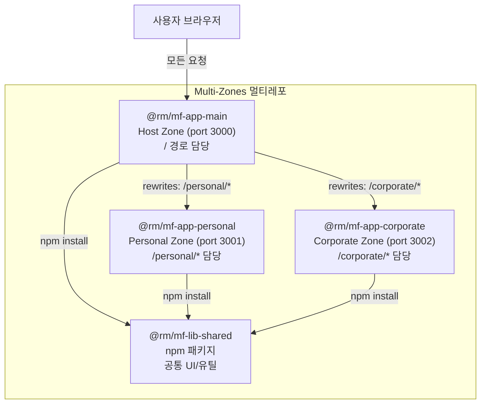

# Next.js 16 마이크로 프론트엔드 멀티레포 구성 계획 (Multi-Zones)

## 왜 Multi-Zones인가?

Next.js 16은 Turbopack을 기본 컴파일러로 채택하면서 **Module Federation 지원을 공식 제거**했습니다.
대신 Next.js 공식 문서는 **Multi-Zones**를 마이크로 프론트엔드의 네이티브 솔루션으로 제시합니다.

- Module Federation: 런타임 번들 공유 방식 (Next.js 16에서 미지원)
- **Multi-Zones: 각 앱이 독립 서버로 실행되고 Host 앱의 `rewrites()`로 라우팅 통합** (공식 지원)

## 전체 아키텍처




## 라우팅 동작 방식

- **같은 Zone 내 이동**: soft navigation (SPA 방식, 페이지 리로드 없음)
- **Zone 간 이동**: hard navigation (전체 페이지 리로드, 각 Zone이 독립 React 환경)
- Zone 간 링크는 반드시 `<a>` 태그 사용 (`<Link>` 컴포넌트 사용 불가)

## 디렉토리 구조

```
nextjs-mf-multi/                    ← 로컬 개발 워크스페이스 (각각 별도 git 저장소)
├── mf-app-main/                    ← @rm/mf-app-main (Host Zone)
├── mf-app-personal/                ← @rm/mf-app-personal (Personal Zone)
├── mf-app-corporate/               ← @rm/mf-app-corporate (Corporate Zone)
└── mf-lib-shared/                  ← @rm/mf-lib-shared (공유 npm 패키지)
```

각 폴더는 **별개의 git 저장소**로 관리합니다.

---

## 핵심 기술 스택

- **Next.js 16** (App Router) — SSR/SSG + SEO 완전 지원
- **Multi-Zones** — Next.js 내장 마이크로 프론트엔드 솔루션 (추가 패키지 불필요)
- **TypeScript 5.x** — 전 앱 공통
- **ESLint (Flat Config)** — Next.js 16은 eslint.config.mjs 방식
- **Prettier** — 코드 포맷
- **tsup** — 공유 라이브러리 번들링

---

## STEP 1: @rm/mf-lib-shared 구성

공유 라이브러리를 **먼저** 구성하고 빌드해야 다른 앱들이 참조할 수 있습니다.

`**mf-lib-shared/package.json` 핵심:**

```json
{
  "name": "@rm/mf-lib-shared",
  "version": "0.1.0",
  "main": "dist/index.js",
  "types": "dist/index.d.ts",
  "exports": {
    ".": {
      "import": "./dist/index.mjs",
      "require": "./dist/index.js",
      "types": "./dist/index.d.ts"
    }
  },
  "scripts": {
    "build": "tsup src/index.ts --format cjs,esm --dts",
    "dev": "tsup src/index.ts --format cjs,esm --dts --watch"
  }
}
```

**내부 구조:**

```
mf-lib-shared/src/
├── components/        ← 공통 UI 컴포넌트 (Button, Input, Modal 등)
├── design-system/     ← 디자인 토큰, 테마, 색상 변수
├── utils/             ← 공통 유틸 함수 (날짜, 포맷팅 등)
├── hooks/             ← 공통 React 훅
└── index.ts           ← 모든 항목 re-export
```

---

## STEP 2: @rm/mf-app-main (Host Zone) 구성

Host Zone은 전체 도메인의 게이트웨이 역할을 하며 `rewrites()`로 다른 Zone에 요청을 프록시합니다.

`**mf-app-main/next.config.ts` 핵심:**

```typescript
import type { NextConfig } from 'next';

const nextConfig: NextConfig = {
  // Host Zone은 assetPrefix 불필요
  experimental: {
    serverActions: {
      allowedOrigins: ['localhost:3000'],
    },
  },
  async rewrites() {
    return [
      {
        source: '/personal',
        destination: `${process.env.PERSONAL_ZONE_URL}/personal`,
      },
      {
        source: '/personal/:path+',
        destination: `${process.env.PERSONAL_ZONE_URL}/personal/:path+`,
      },
      {
        source: '/personal-static/:path+',
        destination: `${process.env.PERSONAL_ZONE_URL}/personal-static/:path+`,
      },
      {
        source: '/corporate',
        destination: `${process.env.CORPORATE_ZONE_URL}/corporate`,
      },
      {
        source: '/corporate/:path+',
        destination: `${process.env.CORPORATE_ZONE_URL}/corporate/:path+`,
      },
      {
        source: '/corporate-static/:path+',
        destination: `${process.env.CORPORATE_ZONE_URL}/corporate-static/:path+`,
      },
    ];
  },
};

export default nextConfig;
```

`**mf-app-main/.env.local` (개발 환경):**

```
PERSONAL_ZONE_URL=http://localhost:3001
CORPORATE_ZONE_URL=http://localhost:3002
```

---

## STEP 3: @rm/mf-app-personal (Personal Zone) 구성

`**mf-app-personal/next.config.ts` 핵심:**

```typescript
import type { NextConfig } from 'next';

const nextConfig: NextConfig = {
  assetPrefix: '/personal-static',
  basePath: '/personal',
};

export default nextConfig;
```

**라우팅 구조:**

```
mf-app-personal/src/app/
├── layout.tsx
├── page.tsx           ← /personal
└── [feature]/
    └── page.tsx       ← /personal/[feature]
```

---

## STEP 4: @rm/mf-app-corporate (Corporate Zone) 구성

`**mf-app-corporate/next.config.ts` 핵심:**

```typescript
import type { NextConfig } from 'next';

const nextConfig: NextConfig = {
  assetPrefix: '/corporate-static',
  basePath: '/corporate',
};

export default nextConfig;
```

---

## STEP 5: ESLint + Prettier 공통 설정

Next.js 16은 **Flat Config** 방식(`eslint.config.mjs`)을 사용합니다.

`**eslint.config.mjs` (각 Next.js 앱):**

```js
import { dirname } from 'path';
import { fileURLToPath } from 'url';
import { FlatCompat } from '@eslint/eslintrc';

const __filename = fileURLToPath(import.meta.url);
const __dirname = dirname(__filename);
const compat = new FlatCompat({ baseDirectory: __dirname });

export default [
  ...compat.extends('next/core-web-vitals', 'next/typescript', 'prettier'),
  {
    rules: {
      '@typescript-eslint/no-explicit-any': 'error',
    },
  },
];
```

`**.prettierrc` (전 패키지 동일):**

```json
{
  "semi": true,
  "singleQuote": true,
  "tabWidth": 2,
  "trailingComma": "es5",
  "printWidth": 100
}
```

---

## STEP 6: 공유 라이브러리 연동

**개발 단계:** `file:` 경로 참조

```json
{
  "dependencies": {
    "@rm/mf-lib-shared": "file:../mf-lib-shared"
  }
}
```

**운영 단계:** GitHub Packages 또는 Verdaccio 프라이빗 레지스트리에 퍼블리시

```bash
npm publish --registry https://npm.pkg.github.com
```

**Zone 간 컴포넌트 공유 방법:**

- 런타임 공유는 불가 (Multi-Zones 특성)
- 반드시 `@rm/mf-lib-shared` npm 패키지를 통해 빌드타임에 공유

---

## 포트 및 실행 순서

```
1. mf-lib-shared     → npm run build (또는 npm run dev --watch)
2. mf-app-personal   → npm run dev -- -p 3001
3. mf-app-corporate  → npm run dev -- -p 3002
4. mf-app-main       → npm run dev (port 3000, 모든 요청의 진입점)
```

브라우저에서 `http://localhost:3000` 접속 시:

- `/` → mf-app-main이 직접 서빙
- `/personal/*` → mf-app-personal(3001)로 프록시
- `/corporate/*` → mf-app-corporate(3002)로 프록시

---

## SEO 전략

Multi-Zones는 각 Zone이 독립적인 Next.js 앱이므로 **모든 Zone에서 완전한 SSR/SSG 사용 가능**합니다.

- 각 Zone 페이지에서 `generateMetadata()` 로 SEO 메타태그 독립 관리
- `sitemap.ts`, `robots.ts` 는 Host Zone(`mf-app-main`)에서 통합 관리
- Zone별 `layout.tsx`에서 공통 메타 설정 상속

---

## Multi-Zones 주요 제약사항 (인지 필요)

- Zone 간 이동 시 **전체 페이지 리로드** 발생 (하드 네비게이션)
- Zone 간 링크는 `<Link>` 대신 `**<a>` 태그** 사용
- 각 Zone의 CSS/폰트는 **서로 캐스케이딩되지 않음** → `@rm/mf-lib-shared`에서 CSS 변수/토큰으로 통일
- 런타임 컴포넌트 공유 불가 → npm 패키지(`@rm/mf-lib-shared`)로 해결

